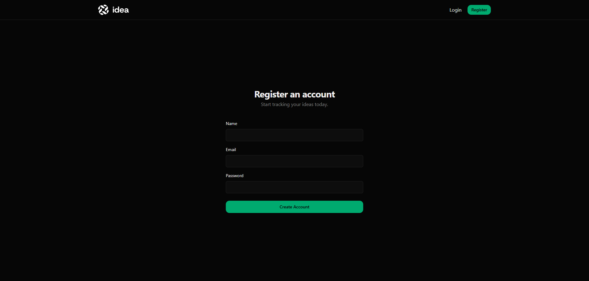
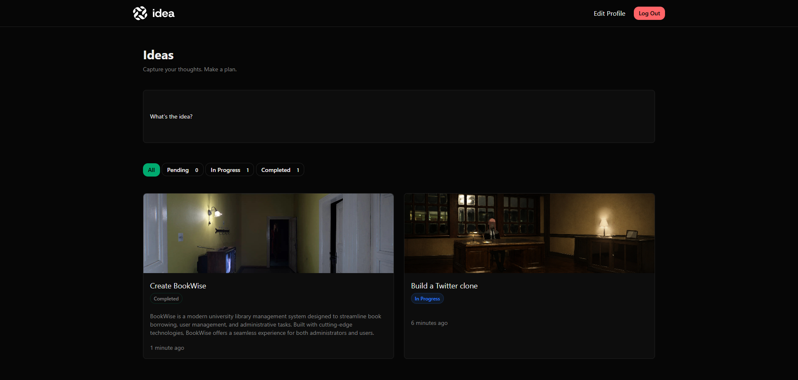
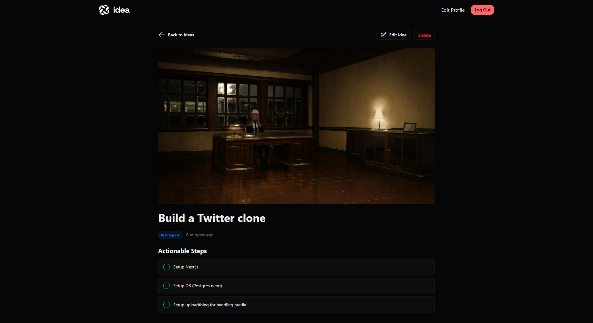
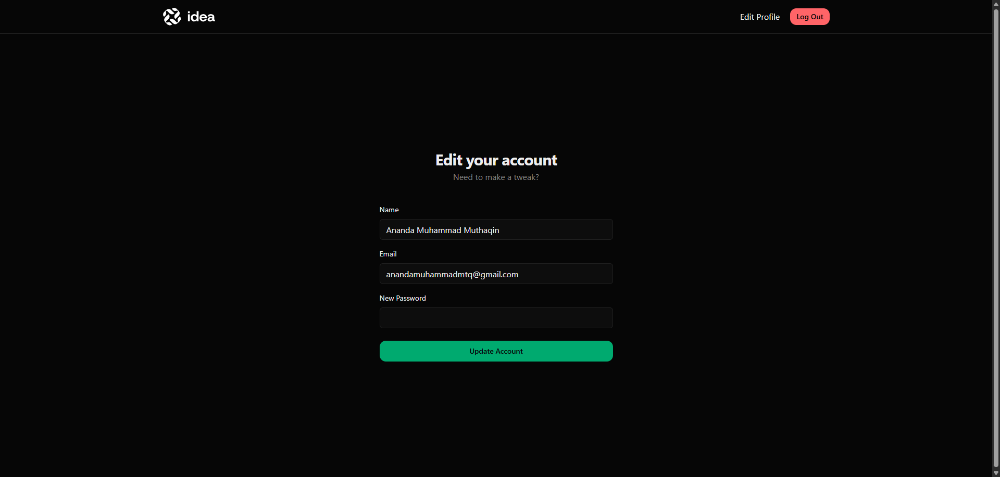

# Idea

A modern idea management application built with Laravel 12 and Tailwind CSS.

## Overview

Idea is a full-stack Laravel application that allows users to create, organize, track, and manage ideas through a clean and responsive interface.

The project was developed while following the Laravel From Scratch 2026 course by Laracasts, with additional improvements and refinements beyond the course material.

## Features

- User registration and authentication
- Create, edit, and delete ideas
- Upload images for ideas
- Track idea progress with statuses
- Manage implementation steps
- Add reference links
- Markdown support for idea descriptions
- Profile management
- Email notifications when email addresses change
- Browser and unit test coverage using Pest

## Technology Stack

### Backend

- Laravel 12
- PHP 8.4
- SQLite

### Frontend

- Blade
- Tailwind CSS 4
- Tailwind Typography
- Alpine.js

### Testing

- Pest
- Laravel Browser Testing

## Installation

```bash
git clone https://github.com/specbit/idea.git
cd idea

composer install
npm install

cp .env.example .env

php artisan key:generate

php artisan migrate

npm run dev

php artisan serve
```

## Running Tests

```bash
./vendor/bin/pest
```

## Screenshots 📸

<div style="margin-top: 12px; margin-bottom: 12px">
  <a href="">
    
  </a>
</div>

<div style="margin-top: 12px; margin-bottom: 12px">
  <a href="">
    
  </a>
</div>

<div style="margin-top: 12px; margin-bottom: 12px">
  <a href="">
    
  </a>
</div>

<div style="margin-top: 12px; margin-bottom: 12px">
  <a href="">
    
  </a>
</div>

## Project Structure

- `app/Models` – Domain models
- `app/Http/Controllers` – Request handling
- `resources/views` – Blade templates
- `tests/Browser` – Browser tests
- `tests/Unit` – Unit tests

## Learning Objectives

This project explores:

- Laravel authentication
- Eloquent ORM
- Authorization
- Form validation
- File uploads
- Notifications
- Testing with Pest
- Modern Tailwind CSS workflows
- Markdown rendering
- Alpine.js-powered interactive UI components
